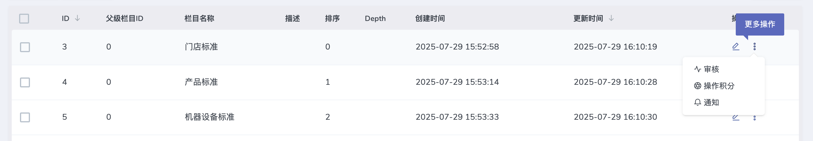
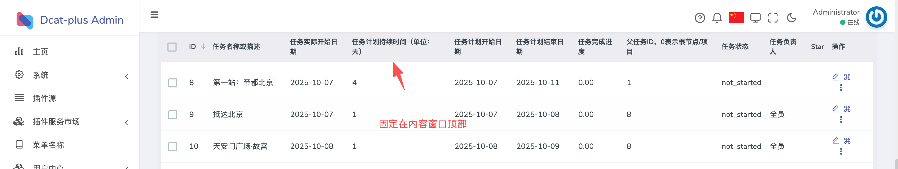
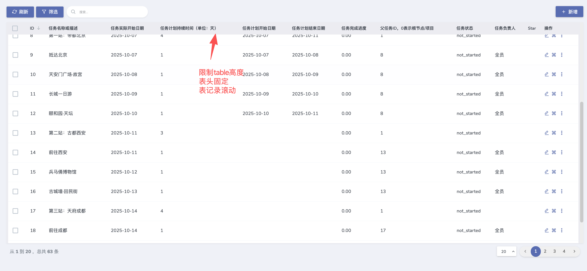
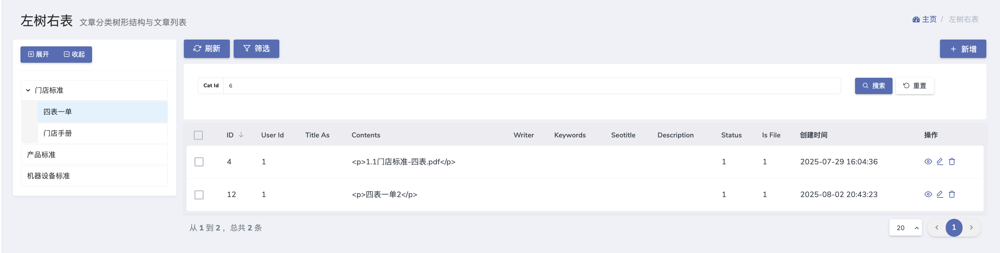
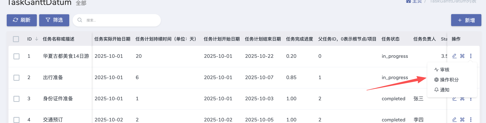

# 更新日志 v1.4.5

- **发布版本**：v1.4.5
- **发布日期**：2026-01-31
- **类型**：功能增强（feat） / 修复（fix） / 优化（perf）

---

## 主要新增

### 1. 增强列隐藏能力
- 修复 `hideColumns()` 的兼容性问题，确保在**启用或禁用列选择器**的两种场景下都能生效。

示例：
```php
$grid->showColumnSelector(); // 启用列选择器
$grid->hideColumns(['text', 'start_date']);
```

### 2. 新增 `hideColumnsWhen()`（条件隐藏）
- 使用 Closure 动态计算要隐藏的列（基于权限、请求参数或复杂逻辑）。

示例：
```php
$grid->hideColumnsWhen(function ($grid) {
    if (request('role') === 'guest') {
        return ['email', 'salary'];
    }
    return ['internal_note'];
});
```

### 3. 统一隐藏逻辑
- 新增 `getHiddenColumns()`，统一汇总来自以下来源的隐藏列：`hideColumns()`、`hideColumnsWhen()`、列级 `hidden()`/`visible()`。
- 这样保证表头、复杂表头与数据列在显示状态上一致。

示例（列级控制）：
```php
$grid->column('text')->visible(fn() => false); // 列级关闭
```

### 4. Actions 分组（group）
- 新增 `group()` 方法，为行操作添加下拉分组展示，便于收纳二级操作。

示例：
```php
$grid->actions(function (Grid\Displayers\Actions $actions) {
    $actions->group(function ($group) {
        $group->append('<a href="##"><i class="feather icon-activity"></i> 审核</a>');
        $group->append('<a href="##"><i class="feather icon-bell"></i> 通知</a>');
    }, 'feather icon-more-vertical', '更多操作');
});
```

### 5. 新增 `CanBeHidden` trait
- 为列与树节点提供统一的 `hidden()` / `visible()` 条件方法，可接收 Closure，以便按上下文动态控制显示。

示例（树节点或列）：
```php
$grid->column('email')->hidden(fn() => !auth()->user()->isAdmin());
```

### 6. 树组件：拖拽控制
- 新增 `disableDraggable()`：关闭拖拽功能。
- 新增 `draggableAutoSave()`：拖拽后自动保存位置。

示例：
```php
$tree->disableDraggable();
$tree->draggableAutoSave(true);
```

### 7. 表格固定表头
- 新增 `tableHeaderFixed()` / `gridHeaderFixed()`，支持固定表头功能。

示例：
```php
// 方式一 基于内容窗口 
$grid->tableHeaderFixed(true);

// 方式二 限制table高度，表头固定内容滚动
$grid->gridHeaderFixed(true);
```


### 8. 左树右表面板（Tree + Table）
- 新增 `treePanel()`，便捷构建「左树右表」布局。

示例：
```php
$grid->treePanel(function($tree) {
    $tree->model(YourModel::class);
    $tree->disableDraggable();
});
```


### 9. 接口请求模式优化
- 在接口（API）请求模式下**不初始化 dcat-admin 前端**，避免与 API 客户端冲突或不必要的资源加载。

---

## 修复与优化

### - 修复：清除快速搜索后未重置查询
- 场景：在使用 `quickSearch()` 后清空搜索框，之前不会重置 Grid 查询条件。
- 修复：搜索为空时会正常重置查询并刷新结果。

示例：
```php
$grid->quickSearch(['text', 'type'])->placeholder('搜索...');
```

### - 修复：固定列（fixed columns）下操作项折叠问题
- 场景：启用固定列后，操作列中附加的折叠/下拉项无法正常显示或交互。
- 修复：操作项支持折叠与交互，保证 UX 一致。


### - 修复：固定列导致中间内容上下滚动问题
- 场景：当左右列固定时，中间区域出现双向滚动/错位。
- 修复：同步滚动逻辑修复，保证中间内容垂直滚动而不影响固定列显示。

### - 兼容性与向后兼容保证
- 保留旧 API 行为，新增接口向下兼容，不影响现有项目升级。

---

## 升级提示
- 请清除视图缓存：`php artisan view:clear`，并清理浏览器缓存。
- 如果替换了前端资源（例如 Element Plus），建议发布/刷新静态资源并重启服务。
