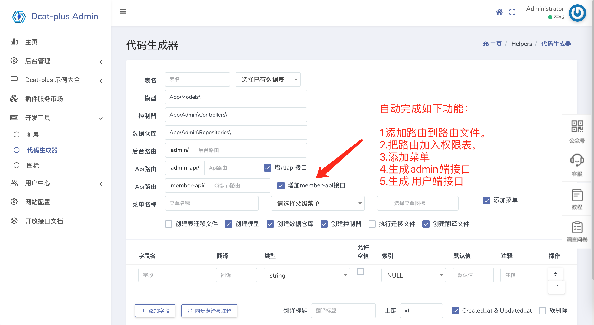
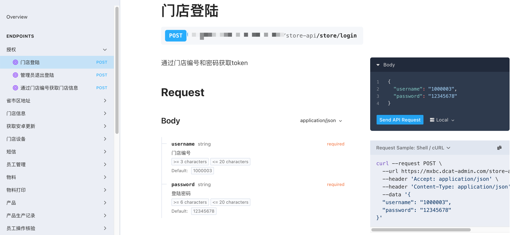
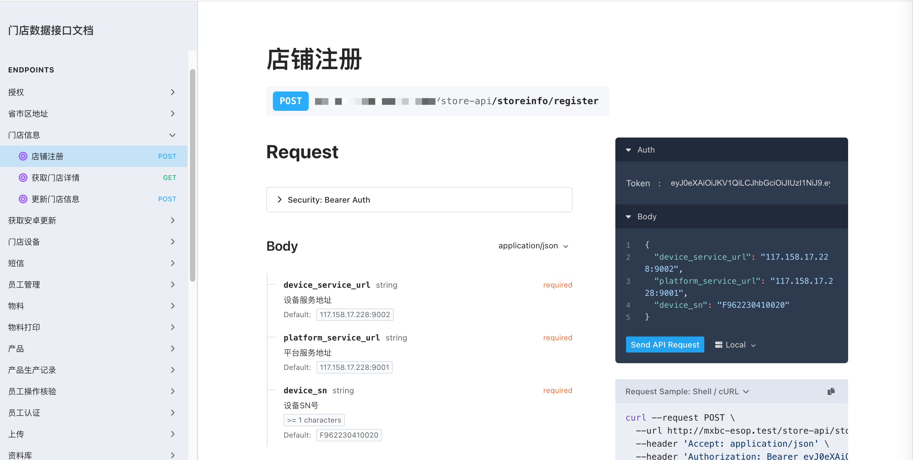

# dcatplus-admin 开放接口文档系统

> dcatplus-admin `1.4.2` 后开始支持开放接口功能

## 1. 特色功能

本系统基于 dcatplus-admin 代码生成器与 [dedoc/scramble](https://scramble.dedoc.co/usage/getting-started) 深度整合，提供以下核心特色：

- **自动化接口生成**：根据数据表结构自动生成 RESTful API
- **多端隔离**：支持多模块接口独立管理（管理端/商家端/用户端）
- **注释即文档**：采用 OpenAPI 3.0 规范，代码注释自动生成文档
- **可视化调试**：内置 API 调试工具，支持在线测试接口
- **权限集成**：与 dcat-admin 权限系统无缝对接
- **版本管理**：支持接口版本控制与历史记录查看
#####  增强后的代码生成器

## 2. 接口模块划分（已自带授权）

系统包含以下独立接口模块：

| 模块名称       | 访问前缀      | 说明                     |
|------------|-------------|-------------------------|
| admin-api  | /admin-api  | 平台管理端接口（超级管理员使用） |
| member-api | /member-api | 用户端接口（客户端用户使用）    |

## 2.1 接口文档呈现效果


## 3. 文档系统特色
### 3.1 智能解析
- 自动识别路由参数、请求方法、响应结构
- 支持 JSON/XML 等多种响应格式展示
- 自动提取验证规则生成参数校验说明

### 3.3 文档配置

`config/scramble.php` 配置  也可直接查看`scramble`官方文档 >> [查看](https://scramble.dedoc.co/usage/getting-started)
```php
<?php

use Dedoc\Scramble\Http\Middleware\RestrictedDocsAccess;

return [
    /*
     * API基础路径。默认情况下，所有以此路径开头的路由都将被添加到文档中。
     * 如需自定义此行为，可以使用`Scramble::routes()`添加自定义路由解析器。
     */
    'api_path' => 'api',

    /*
     * API域名。默认使用应用域名。这也是默认API路由匹配器的一部分，
     * 如果自行实现路由匹配器，请确保在需要时使用此配置。
     */
    'api_domain' => null,

    /*
     * OpenAPI规范文件的导出路径。
     */
    'export_path' => 'api.json',

    'info' => [
        /*
         * API版本号。
         */
        'version' => env('API_VERSION', '0.0.1'),

        /*
         * 在API文档首页(`/docs/api`)显示的描述文本。
         */
        'description' => '用户端Api文档',
    ],

    /*
     * 自定义Stoplight Elements UI
     */
    'ui' => [
        /*
         * 文档网站的标题。为null时使用应用名称。
         */
        'title' => '用户端Api文档',

        /*
         * 文档主题。可选值为`light`和`dark`。
         */
        'theme' => 'light',

        /*
         * 隐藏"Try It"功能。默认启用。
         */
        'hide_try_it' => false,

        /*
         * 在目录中隐藏Schema。默认启用。
         */
        'hide_schemas' => false,

        /*
         * 显示在标题旁边的小型方形logo图片URL，位于目录上方。
         */
        'logo' => '',

        /*
         * 控制"Try It"功能的凭证策略。可选值：omit(忽略)、include(包含，默认)、same-origin(同源)
         */
        'try_it_credentials_policy' => 'include',

        /*
         * Elements提供的三种布局：
         * - sidebar (Elements默认)：三栏设计，带有可调整大小的侧边栏
         * - responsive：类似sidebar，但在小屏幕下会将侧边栏折叠为可切换的抽屉式菜单
         * - stacked：单栏布局，适合已自带侧边栏的现有网站集成
         */
        'layout' => 'responsive',
    ],

    /*
     * API服务器列表。默认null时，服务器URL会根据`scramble.api_path`和`scramble.api_domain`配置自动生成。
     * 如果提供数组，则需要手动指定本地服务器URL(如果需要)。
     *
     * 非默认配置示例(最终URL使用Laravel的`url`辅助函数生成):
     *
     * ```php
     * 'servers' => [
     *     'Live' => 'api',
     *     'Prod' => 'https://scramble.dedoc.co/api',
     * ],
     * ```
     */
    'servers' => null,

    /**
     * 控制Scramble如何存储枚举用例的描述。
     * 可用选项：
     * - 'description'：将用例描述存储为枚举Schema的描述(使用表格格式)
     * - 'extension'：将用例描述存储在枚举Schema的`x-enumDescriptions`扩展中
     *
     *    @see https://redocly.com/docs-legacy/api-reference-docs/specification-extensions/x-enum-descriptions
     * - false：忽略枚举用例描述
     */
    'enum_cases_description_strategy' => 'description',

    'middleware' => [
        'web',
        RestrictedDocsAccess::class,
    ],

    'extensions' => [

    ],
];
```
### 3.4 生成多个文档 
例如：需要生成一个 商家端api文档. 文档访问的地址是：http://www.xxx.com/docs/store-api#/

在 `app/Providers/AppServiceProvider.php` 的 `boot` 方法中添加如下代码
```php
        // 注册 store-api 文档
        $store_api_path = config('admin.openapi.store-api.api_path','store-api'); // 可以从配置文件中获取
        \Dedoc\Scramble\Scramble::registerApi($store_api_path, [
            'api_path' => $store_api_path,
            'info' => [
                'version' => config('admin.openapi.store-api.info.version','1.0.0'),
                'description' => config('admin.openapi.store-api.info.description','管理端api文档'),
            ],
            'servers' => [
              'Local' => $store_api_path, // 本地环境
              'Prod'=> env('APP_API_URL').'/'.$store_api_path, // 线上环境
            ],
            'ui' => [
                'title' => config('admin.openapi.store-api.ui.title','B端Api文档'),
            ]
        ])->withDocumentTransformers(function (OpenApi $openApi) {
            $openApi->secure(
                SecurityScheme::http('Bearer','JWT')
            );
        });

        // 注册api路由
        \Dedoc\Scramble\Scramble::registerUiRoute('docs/'.$store_api_path,$store_api_path);
        \Dedoc\Scramble\Scramble::registerJsonSpecificationRoute('docs/'.$store_api_path.'json', $store_api_path);

        // 配置
        Scramble::configure()
            ->withDocumentTransformers(function (OpenApi $openApi) {
                $openApi->secure(
                    SecurityScheme::http('Bearer','JWT')
                );
            });
```
### 3.4.1 生成多个文档的呈现效果预览


### 3.5 交互式文档
```php
use App\Models\StoreUser;
use Dedoc\Scramble\Attributes\QueryParameter;
use Dedoc\Scramble\Attributes\BodyParameter;
use Dedoc\Scramble\Attributes\Group;

#[Group('授权','用户授权',1)]
class StoreAuthController extends  Controller
{
    /**
     * 门店登陆
     * 通过门店编号和密码获取token
     * @unauthenticated
     * @operationId storeLogin
     */
    public function login(Request $request){
        $request->validate(
            [
                /**
                 * 门店编号
                 *@default 1000003
                 */
                'username' => ['required','string','min:3','max:20',Rule::exists(StoreUser::class, 'username')],
                /**
                 * 登陆密码
                 * @default 12345678
                 */
                'password' => ['required','string','min:6','max:20'],
            ], [
                'username.required' => '请填写用户名',
                'username.min' => '用户名长度不能小于3个字符',
                'username.max' => '用户名长度不能大于20个字符',
                'username.exists' => '用户名不存在',
                'password.required' => '请填写密码',
                'password.min' => '密码长度不能小于6个字符',
                'password.max' => '密码长度不能大于20个字符',

            ]
        );
}
```


