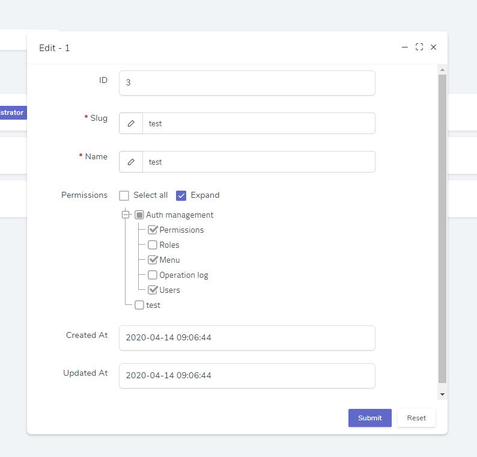

## 示例
`Dcat\Admin\Form`类用于快速生成表单页面，先来个例子，数据库中有`movies`表

```sql
CREATE TABLE `movies` (
  `id` int(10) unsigned NOT NULL AUTO_INCREMENT,
  `title` varchar(255) COLLATE utf8_unicode_ci NOT NULL,
  `director` int(10) unsigned NOT NULL,
  `describe` varchar(255) COLLATE utf8_unicode_ci NOT NULL,
  `rate` tinyint unsigned NOT NULL,
  `released` enum(0, 1),
  `release_at` timestamp NOT NULL DEFAULT '0000-00-00 00:00:00',
  `created_at` timestamp NOT NULL DEFAULT '0000-00-00 00:00:00',
  `updated_at` timestamp NOT NULL DEFAULT '0000-00-00 00:00:00',
  PRIMARY KEY (`id`)
) ENGINE=InnoDB DEFAULT CHARSET=utf8 COLLATE=utf8_unicode_ci;

```

对应的数据模型为`App\Models\Movie`，数据仓库为`App\Admin\Repositories\Movie`：

```php
use App\Admin\Repositories\Movie;
use Dcat\Admin\Form;
use Dcat\Admin\Admin;

$form = Form::make(new Movie(), function (Form $form) {
    // 显示记录id
    $form->display('id', 'ID');
    
    // 添加text类型的input框
    $form->text('title', '电影标题');
    
    $directors = [
        1 => 'John',
        2 => 'Smith',
        3 => 'Kate',
    ];
    
    $form->select('director', '导演')->options($directors);
    
    // 添加describe的textarea输入框
    $form->textarea('describe', '简介');
    
    // 数字输入框
    $form->number('rate', '打分');
    
    // 添加开关操作
    $form->switch('released', '发布？');
    
    // 添加日期时间选择框
    $form->datetime('release_at', '发布时间');
    
    // 两个时间显示
    $form->display('created_at', '创建时间');
    $form->display('updated_at', '修改时间');
});
```

## 数据仓库

数据仓库(`Repository`)是一个可以提供特定接口对数据进行读写操作的类，通过数据仓库的引入，可以让页面的构建不再关心数据读写功能的具体实现。只需要实现特定的操作接口即可轻松切换数据源，关于数据仓库的详细用法请参考文档[数据仓库](https://learnku.com/docs/dcat-admin/1.x/basic-use/8123)。


## 表单定义

推荐使用以下方式构建表单
```php
use App\Admin\Repositories\Movie;
use Dcat\Admin\Form;
use Dcat\Admin\Admin;

$form = Form::make(new Movie, function (Form $form) {
    // 显示记录id
    $form->display('id', 'ID');

    $form->select('director', '导演')->options($directors);
    
    ...
});
```

### 获取当前模型数据

在闭包内可以获取到当前模型的数据（编辑）
```php
Form::make(new Movie, function (Form $form) {
    // 显示记录id
    $form->display('id', 'ID');

    // 获取模型数据，如果"status == 1"则显示"rate"字段
    if ($form->model()->status == 1) {
        $form->number('rate');
    }
    
    $form->select('director', '导演')->options($directors);
    
    ...
});
```


## 自定义工具

表单右上角默认有返回和跳转列表两个按钮工具, 可以使用下面的方式修改它:

```php
$form->tools(function (Form\Tools $tools) {
    // 去掉跳转列表按钮
    $tools->disableList();
    // 去掉跳转详情页按钮
    $tools->disableView();
    // 去掉删除按钮
    $tools->disableDelete();

    // 添加一个按钮, 参数可以是字符串, 匿名函数, 或者实现了Renderable或Htmlable接口的对象实例
    $tools->append('<a class="btn btn-sm btn-danger"><i class="fa fa-trash"></i>&nbsp;&nbsp;delete</a>');
});

// 去除整个工具栏内容
$form->disableHeader();

// 也可以通过以下方式去除工具栏的默认按钮
$form->disableListButton();
$form->disableViewButton();
$form->disableDeleteButton();
```

自定义视图

自定义视图

```php
$form->footer(function ($footer) {
    $footer->view('...', [...]);
});
```

### 自定义复杂工具按钮

请参考文档[数据表单动作](https://learnku.com/docs/dcat-admin/1.x/data-form/8450)


## 表单底部
使用下面的方法去掉form底部的元素

```php
$form->footer(function ($footer) {

    // 去掉`重置`按钮
    $footer->disableReset();

    // 去掉`提交`按钮
    $footer->disableSubmit();

    // 去掉`查看`checkbox
    $footer->disableViewCheck();

    // 去掉`继续编辑`checkbox
    $footer->disableEditingCheck();

    // 去掉`继续创建`checkbox
    $footer->disableCreatingCheck();
    
    // 设置`查看`默认选中
    $footer->defaultViewChecked();

    // 设置`继续编辑`默认选中
    $footer->defaultEditingChecked();
    
    // 设置`继续创建`默认选中
    $footer->defaultCreatingChecked();
});

// 去除整个底部内容
$form->disableFooter();

// 也可以通过以下方式去底部元素
$form->disableSubmitButton();
$form->disableResetButton();
$form->disableViewCheck();
$form->disableEditingCheck();
$form->disableCreatingCheck();

// 设置`查看`默认选中
$form->defaultViewChecked();

// 设置`继续编辑`默认选中
$form->defaultEditingChecked();

// 设置`继续创建`默认选中
$form->defaultCreatingChecked();
```

## 常用方法

### 布局
参考文档[表单布局](https://learnku.com/docs/dcat-admin/1.x/table-layout/8822)


### 返回字段验证出错信息

通过`responseValidationMessages`方法可以很方便的返回字段验证出错信息，而不需要使用`Laravel validation`功能。

普通使用
```php
protected function form()
{
    return Form::make(new Model(), function (Form $form) {
        if (...) { // 验证逻辑
            $form->responseValidationMessages('title', 'title格式错误');
            
            // 如有多个错误信息，第二个参数可以传数组
            $form->responseValidationMessages('content', ['content格式错误', 'content不能为空']);
        }
    });
}
```
在事件中使用
> 此方法仅在`submitted`事件中可用

```php
$form->submitted(function (Form $form) {
    // 接收表单参数
    $title = $form->title;

    if (...) { // 验证逻辑
        $form->responseValidationMessages('title', 'title格式错误');
        
        // 如有多个错误信息，第二个参数可以传数组
        $form->responseValidationMessages('content', ['content格式错误', 'content不能为空']);
    }
});
```

### 去掉提交按钮:

```php
$form->disableSubmitButton();
```

### 去掉重置按钮:
```php
$form->disableResetButton();
```

### 忽略掉不需要保存的字段 (ignore)

```php
$form->ignore(['column1', 'column2', 'column3']);

// 取消已忽略的字段
$form->removeIgnoredFields(['column1',]);
```

### 设置宽度 (width)

此处的宽度值是一个`1-12`之间的数字，第一个参数为 ```field``` 的宽，第二个参数为 ```label``` 的宽，第二个可省略。

```php
$form->width(10, 2); // field, label
```

### 设置表单提交的action

```php
$form->action('auth/users');
```

### 判断是否是新增 (isCreating)

新增页面和保存新增数据都可以用这个方法判断

```php
if ($form->isCreating()) {
    ...
}
```

### 判断是否是编辑 (isEditing)

编辑页面和保存编辑数据都可以用这个方法判断

```php
if ($form->isEditing()) {
    ...
}
```

### 判断是否是删除 (isDeleting)

```php
if ($form->isDeleting()) {
    ...
}
```

### 获取ID (getKey)

新增页面无效

```php
return Form::make(new User, function (Form $form) {
    $id = $form->getKey();
    
    ...
});
```

### 获取编辑数据 (model)
新增页面无效，必须在闭包里面使用

```php
return Form::make(new User, function (Form $form) {
 $username = $form->model()->xxx;     ...
});
```

### 获取表单提交的数据 (input)

```php
$form->saving(function (Form $form) {
    $username = $form->username;
    
    // 等同于
    $username = $form->input('username');
});
```

### 修改或删除表单提交的数据

```php
$form->saving(function (Form $form) {
    // 修改
    $form->input('username', 'Marry');
    // 或
    $form->username = 'Marry';
    
    // 删除
    $form->deleteInput('username');
});
```


### 获取最终保存的数据 (updates)

此方法仅在`saved`回调有效。

```php
$form->saved(function (Form $form) {

    $data = $form->updates();
    
});
```

<a name="redirect"></a>
### 页面跳转 (redirect)

跳转到指定页面，此方法仅在[表单回调](https://learnku.com/docs/dcat-admin/1.x/event/8113)事件内可用

```php
// 跳转并提示成功信息
$form->saved(function (Form $form) {
    return $form->response()->success('保存成功')->redirect('auth/user');
});

// 跳转并提示错误信息
$form->saving(function (Form $form) {
    return $form->response()->error('系统错误')->redirect('auth/user');
});
```


<a name="confirm"></a>
### 显示确认弹窗 (confirm)


点击表单提交按钮时弹出确认弹窗，如果是在普通数据表单中
```php
$form->confirm('您确定要提交表单吗？', 'content');
```


### 设置外层容器
```php
 // 更改表格外层容器
$form->wrap(function (Renderable $view) {
    $tab = Tab::make();
    
    $tab->add('示例', $view);
    $tab->add('代码', $this->code(), true);

    return $tab;
});
```


<a name="saving"></a>
### 修改待保存的表单输入值 (saving)

通过`saving`方法可以更改待保存数据的格式。

```php
use Dcat\Admin\Support\Helper;

$form->mutipleFile('files')->saving(function ($paths) {
    $paths = Helper::array($paths);
    
    // 获取数据库当前行的其他字段
    $username = $this->username;
    
    // 最终转化为json保存到数据库
    return json_encode($paths);
});
```

<a name="customFormat"></a>
### 修改表单数据显示 (customFormat)
通过`customFormat`方法可以改变从外部注入到表单的字段值。

如下例子中，`mutipleFile`字段要求待渲染的字段值为数组格式，我们可以通过`customFormat`方法把从数据库查出的字段值转化为`array`格式
```php
use Dcat\Admin\Support\Helper;

$form->mutipleFile('files')->saving(function ($paths) {
    $paths = Helper::array($paths);
    
    return json_encode($paths);
})->customFormat(function ($paths) {
    // 获取数据库当前行的其他字段
    $username = $this->username;

    // 转为数组
    return Helper::array($paths);
});
```


## 关联模型


### 一对一

`users`表和`profiles`表通过`profiles.user_id`字段生成一对一关联

```sql
CREATE TABLE `users` (
`id` int(10) unsigned NOT NULL AUTO_INCREMENT,
`name` varchar(255) COLLATE utf8_unicode_ci NOT NULL,
`email` varchar(255) COLLATE utf8_unicode_ci NOT NULL,
`created_at` timestamp NOT NULL DEFAULT '0000-00-00 00:00:00',
`updated_at` timestamp NOT NULL DEFAULT '0000-00-00 00:00:00',
PRIMARY KEY (`id`)
) ENGINE=InnoDB DEFAULT CHARSET=utf8 COLLATE=utf8_unicode_ci;

CREATE TABLE `profiles` (
`id` int(10) unsigned NOT NULL AUTO_INCREMENT,
`user_id` varchar(255) COLLATE utf8_unicode_ci NOT NULL,
`age` varchar(255) COLLATE utf8_unicode_ci NOT NULL,
`gender` varchar(255) COLLATE utf8_unicode_ci NOT NULL,
`created_at` timestamp NOT NULL DEFAULT '0000-00-00 00:00:00',
`updated_at` timestamp NOT NULL DEFAULT '0000-00-00 00:00:00',
PRIMARY KEY (`id`)
) ENGINE=InnoDB DEFAULT CHARSET=utf8 COLLATE=utf8_unicode_ci;
```

对应的数据模分别为:

```php
<?php

namespace App\Admin\Models;

use Illuminate\Database\Eloquent\Model;

class User extends Model
{
    public function profile()
    {
        return $this->hasOne(Profile::class);
    }
}

class Profile extends Model
{
    public function user()
    {
        return $this->belongsTo(User::class);
    }
}
```
对应的数据仓库为：
```php
<?php

namespace App\Admin\Repositories;

use Dcat\Admin\Repositories\EloquentRepository;
use User as UserModel;

class User extends \Dcat\Admin\Repositories\EloquentRepository
{
    protected $eloquentClass = UserModel::class;
}
```


通过下面的代码可以关联在一个form里面:
> 实例化数据仓库时需要传入关联模型定义的关联名称，相当于主动使用`Eloquent\Model::with`方法。

```php
use App\Admin\Repositories\User;

// 注意这里实例化数据仓库`User`时必须传入"profile"，否则将无法关联"profiles"表数据
$form = Form::make(new User('profile'), function (Form $form) {
    $form->display('id');
    
    $form->text('name');
    $form->text('email');
    
    $form->text('profile.age');
    $form->text('profile.gender');
    
    $form->datetime('created_at');
    $form->datetime('updated_at');
});
```

如果你不想使用数据仓库，也可以直接使用模型
```php
use App\Admin\Models\User;

// 注意这里是直接使用模型，没有使用数据仓库
$form = Form::make(User::with('profile'), function (Form $form) {
    $form->display('id');
    
    ...
});
```


### 一对多

一对多的使用请参考文档[表单字段的使用-一对多](https://learnku.com/docs/dcat-admin/1.x/use-of-fields/8107#onemany)

### 多对多


下面以项目内置的`角色管理`模块的**角色绑定权限**功能为例来演示多对多关联模型的用法

模型`Role`
```php
<?php

namespace Dcat\Admin\Models;

use Dcat\Admin\Traits\HasDateTimeFormatter;
use Illuminate\Database\Eloquent\Model;
use Illuminate\Database\Eloquent\Relations\BelongsToMany;

class Role extends Model
{
    use HasDateTimeFormatter;

    /**
     * 定义你的关联模型.
     *
     * @return BelongsToMany
     */
    public function permissions(): BelongsToMany
    {
        $pivotTable = 'admin_role_permissions'; // 中间表

        $relatedModel = Permission::class; // 关联模型类名

        return $this->belongsToMany($relatedModel, $pivotTable, 'role_id', 'permission_id');
    }
}
```

```php
use Dcat\Admin\Models\Permission;

// 实例化数据仓库时传入 permissions，则会自动关联关联模型的数据
// 这里传入 permissions 关联权限模型的数据
$repository = new Role(['permissions']);

return Form::make($repository, function (Form $form) {
    $form->display('id', 'ID');

    $form->text('slug', trans('admin.slug'))->required();
    $form->text('name', trans('admin.name'))->required();
    
    // 这里的数据会自动保存到关联模型中
    $form->tree('permissions')
        ->nodes(function () {
            return (new Permission())->allNodes();
        })
        ->customFormat(function ($v) {
            if (!$v) return [];

            // 这一步非常重要，需要把数据库中查出来的二维数组转化成一维数组
            return array_column($v, 'id');
        });

    ...
});
```

如果你不想使用数据仓库，也可以直接使用模型
```php
use Dcat\Admin\Models\Role;

// 注意这里是直接使用模型，没有使用数据仓库
$form = Form::make(Role::with('permissions'), function (Form $form) {
    $form->display('id');
    
    ...
});
```

最终效果如下




### 关联模型名称为驼峰风格

如果你的关联模型名称的命名是**驼峰**风格，那么使用的时候需要转化为**下划线**风格命名（v2.0.21-beta之前）


例如
```php
class User extend Model
{
    public function userProfile()
    {
        return ...;
    }
}
```

使用
```php
return Form::make(User::with(['userProfile']), function (Form $form) {

    ...
    
    // 注意这里必须使用下划线风格命名，否则将无法显示编辑数据，从v2.0.21-beta版本开始已经支持驼峰命名
    $form->text('user_profile.postcode');
    $form->text('user_profile.address');
    
});
```
