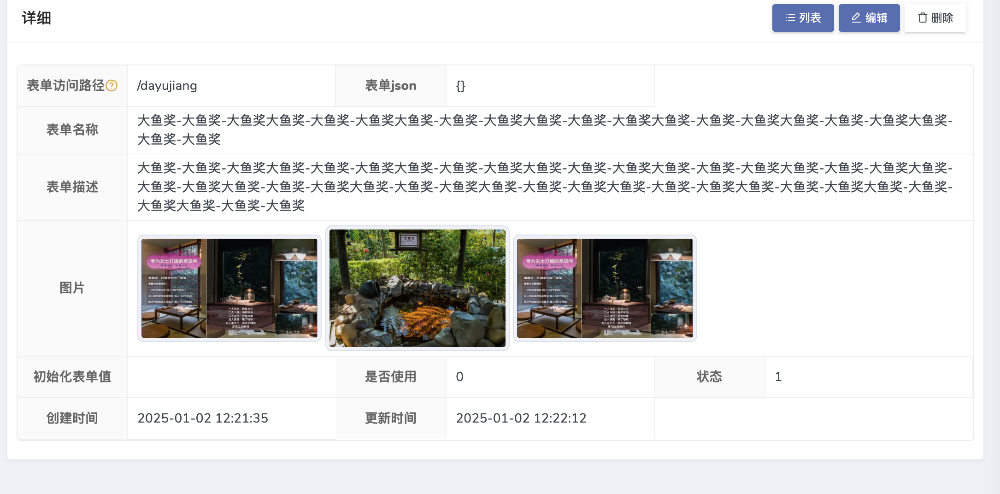
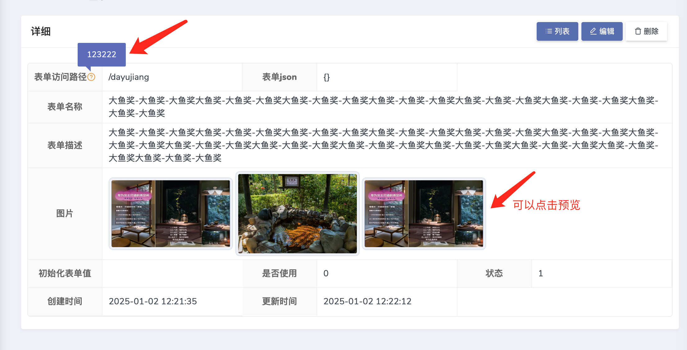
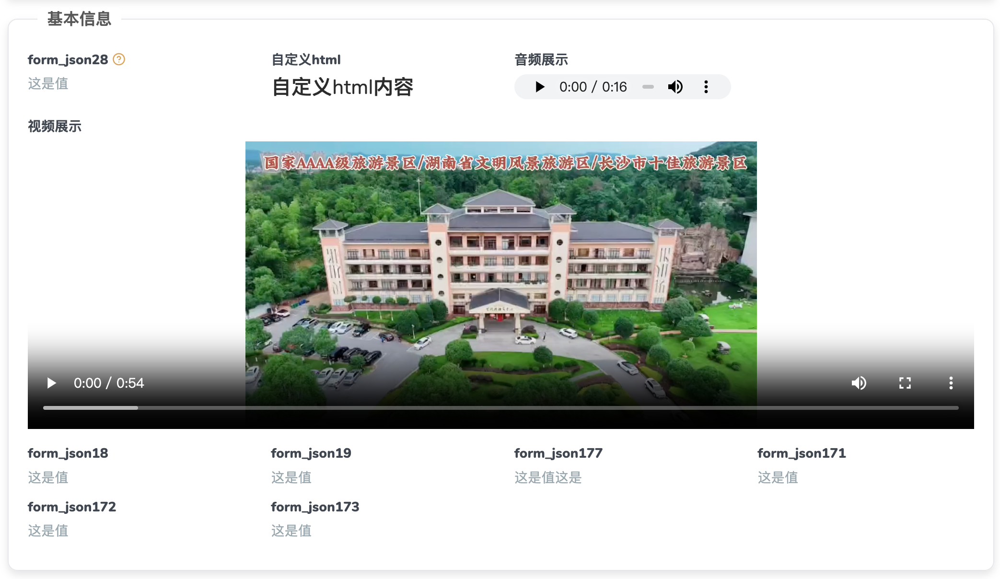

### 卡片Descriptions布局
>  (plus版 `1.3.4` 开始支持 )
##### 一睹效果



##### 使用示例

```php
$show->card(function (Show\Descriptions $descrs) {
                //$descrs->columns(3) // 设置几列，最高支持6列
                //->card() // 开启卡片效果
                //->shadow() // 开启卡片阴影立体效果
                //->labelWidth('130px') // 标题 label 宽度
                //->labelJustifyContent('flex-end') // 标题 label 对齐方式
                //->contentJustifyContent('center') // 内容 content 对齐方式
                //->contentWhiteSpace(); // content 是否换行
                //->footer('卡片底部') // 开启卡片 footer
                //->header('<div class="header-title" style="display: flex;align-items: center;justify-content: center;"><i class="feather icon-file-text f22 text-orange-1"></i>  卡片头部</div>'); // // 开启卡片 header

                $descrs->field('form_path')->help('123222');
                $descrs->field('form_json');
                $descrs->field('form_name')->dedicatedLine(); //独占一行
                $descrs->field('form_desc')->dedicatedLine(); //独占一行
                $descrs->field('form_img','图片')->image('','200','200')->dedicatedLine();
                $descrs->field('form_value');
                $descrs->field('is_use','是否使用');
                $descrs->field('status','状态');
                $descrs->field('created_at');
                $descrs->field('updated_at');
            });
```
##### 对齐方式 所对应的可选值

> 也就是 css justify-content的值：
```css
/* 对齐方式 */
justify-content: center;     /* 居中排列 */
justify-content: start;      /* 从行首开始排列 */
justify-content: end;        /* 从行尾开始排列 */
justify-content: flex-start; /* 从行首起始位置开始排列 */
justify-content: flex-end;   /* 从行尾位置开始排列 */
justify-content: left;       /* 一个挨一个在对齐容器得左边缘 */
justify-content: right;      /* 元素以容器右边缘为基准，一个挨着一个对齐, */

/* 基线对齐 */
justify-content: baseline;
justify-content: first baseline;
justify-content: last baseline;

/* 分配弹性元素方式 */
justify-content: space-between;  /* 均匀排列每个元素
                                   首个元素放置于起点，末尾元素放置于终点 */
justify-content: space-around;  /* 均匀排列每个元素
                                   每个元素周围分配相同的空间 */
justify-content: space-evenly;  /* 均匀排列每个元素
                                   每个元素之间的间隔相等 */
justify-content: stretch;       /* 均匀排列每个元素
                                   'auto'-sized 的元素会被拉伸以适应容器的大小 */

/* 溢出对齐方式 */
justify-content: safe center;
justify-content: unsafe center;

/* 全局值 */
justify-content: inherit;
justify-content: initial;
justify-content: unset;
```
### fieldset 布局 
>  (plus版 `1.3.5` 开始支持 )

##### 一睹效果


##### 使用示例
```php
$show->fieldset(function (Show\Fieldset $field) {
    $field->columns(4) // // 设置几列，最高支持6列
        ->shadow() // 开启阴影立体效果
        //->setShadow() // 设置阴影立体效果 如：box-shadow: 0 4px 8px rgba(0, 0, 0, 0.1);
        ->contentWhiteSpace(); // content 是否换行
    $field->title('基本信息'); // 
    $field->field('form_json28','form_json28')->value('这是值')->help('这是提示');
    $field->field('form_json15','自定义html')->html()->value('<div><h3>自定义html内容</h3></div>');
    $field->field('form_json16','音频展示')->audio('/img/2.mp3');
    $field->field('form_json17','视频展示')
                                    ->video('/img/2025-2-28.mp4','100%','400')
                                    ->dedicatedLine();  //( dedicatedLine() 独占一行)
    $field->field('form_json18','form_json18')->value('这是值');
    $field->field('form_json19','form_json19')->value('这是值');
    $field->field('form_json177','form_json177')->value('这是值这是');
    $field->field('form_json171','form_json171')->value('这是值');
    $field->field('form_json172','form_json172')->value('这是值');
    $field->field('form_json173','form_json173')->value('这是值');

});
```