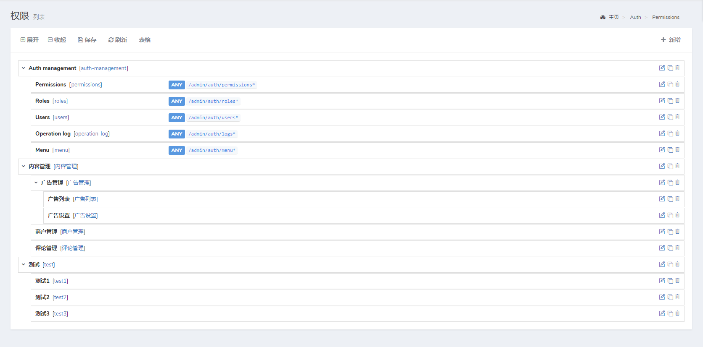

这个功能可以实现一个树状组件，可以用拖拽的方式实现数据的层级、排序等操作，下面是基本的用法。




## 表结构和模型
要使用`model-tree`，要遵守约定的表结构：

> {tip} `parent_id`字段一定要默认为`0`！！！

```sql
CREATE TABLE `demo_categories` (
  `id` int(10) unsigned NOT NULL AUTO_INCREMENT,
  `parent_id` int(11) NOT NULL DEFAULT '0',
  `order` int(11) NOT NULL DEFAULT '0',
  `title` varchar(50) COLLATE utf8_unicode_ci NOT NULL,
  # 此字段非必须
  # `depth` tinyint(4) COLLATE utf8_unicode_ci NOT NULL DEFAULT 1,
  `created_at` timestamp NOT NULL DEFAULT CURRENT_TIMESTAMP,
  `updated_at` timestamp NOT NULL DEFAULT CURRENT_TIMESTAMP ON UPDATE CURRENT_TIMESTAMP,
  PRIMARY KEY (`id`)
) ENGINE=InnoDB DEFAULT CHARSET=utf8 COLLATE=utf8_unicode_ci
```
上面的表格结构里面有三个必要的字段`parent_id`、`order`、`title`,其它字段没有要求。

对应的模型为`app/Models/Category.php`:
```php
<?php

namespace App\Models\Demo;

use Dcat\Admin\Traits\ModelTree;
use Illuminate\Database\Eloquent\Model;

class Category extends Model
{
    use ModelTree;

    protected $table = 'demo_categories';
}
```
表结构中的三个字段`parent_id`、`order`、`title`的字段名也是可以修改的：

> {tip} 为了便于阅读，这里不再展示 `Repository` 代码。

```php
<?php

namespace App\Models\Demo;

use Dcat\Admin\Traits\ModelTree;
use Illuminate\Database\Eloquent\Model;

class Category extends Model
{
    use ModelTree;

    protected $table = 'demo_categories';
    
    // 父级ID字段名称，默认值为 parent_id
    protected $parentColumn = 'pid';
    
    // 排序字段名称，默认值为 order
    protected $orderColumn = 'sort';
    
    // 标题字段名称，默认值为 title
    protected $titleColumn = 'name';
    
    // Since v2.1.6-beta，定义depthColumn属性后，将会在数据表保存当前行的层级
    protected $depthColumn = 'depth';
}
```

## 使用方法
然后就是在页面中使用`model-tree`了：
```php
<?php

namespace App\Admin\Controllers\Demo;

use App\Models\Category;
use Dcat\Admin\Layout\Row;
use Dcat\Admin\Layout\Content;
use Dcat\Admin\Tree;
use Dcat\Admin\Http\Controllers\AdminController;

class CategoryController extends AdminController
{
    public function index(Content $content)
    {
        return $content->header('树状模型')
            ->body(function (Row $row) {
                $tree = new Tree(new Category);
                
                $row->column(12, $tree);
            });
    }
}
```
可以通过下面的方式来修改行数据的显示：
```php
$tree = new Tree(new Category);

$tree->branch(function ($branch) {
    $src = config('admin.upload.host') . '/' . $branch['logo'] ;
    $logo = "";

    return "{$branch['id']} - {$branch['title']} $logo";
});
```
在回调函数中返回的字符串类型数据，就是在树状组件中的每一行的显示内容，`$branch`参数是当前行的数据数组。

### 修改模型查询条件

如果要修改模型的查询，用下面的方式
```php
$tree->query(function ($model) {
    return $model->where('type', 1);
});
```

### 限制最大层级数

默认 `5`

```php
$tree->maxDepth(3);
```

### 展开子节点数据


```php
$tree->expand();
```
### 收起所有子节点数据


```php
$tree->expand(false);
```

### 快速创建

默认新增按钮为跳转页面创建表单，使用快速创建可改为异步创建表单

```php
$tree->disableCreateButton();
```

## 自定义行操作

```php
use Dcat\Admin\Tree;

$tree->actions(function (Tree\Actions $actions) {
    if ($actions->row->id > 5) {
        $actions->disableDelete(); // 禁用删除按钮
    }

    // 添加新的action
    $actions->append(...);
});

// 批量添加action
$tree->actions([
    new Action1(),
    "<div>...</div>",
    ...
]);
```
## 使用Tree小技巧
> 可以在表单页,或其它页面中使用tree,并设置 `$tree->setResource(admin_url('/demo-categories'));` ,也能实现crud的效果. 前提是你已经配置了 `demo-categories` 资源路由

## plus版 `v1.3.0` 开始支持以下能力
```php
## 开启拖拽后自动保存
  $tree->draggableAutoSave();

## 禁用展示按钮
  $tree->disableExpandButton();

## 禁用收起按钮
  $tree->disableCollapseButton();
  
## 禁用整个工具栏
  $tree->disableToolbar();
  
## 设置创建按钮的展示文字
  $tree->setCreateBtnTxt('添加一项');
  
```


